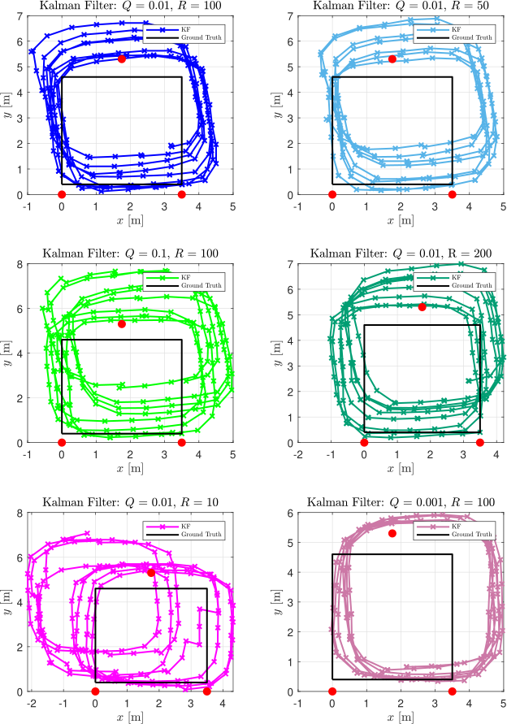
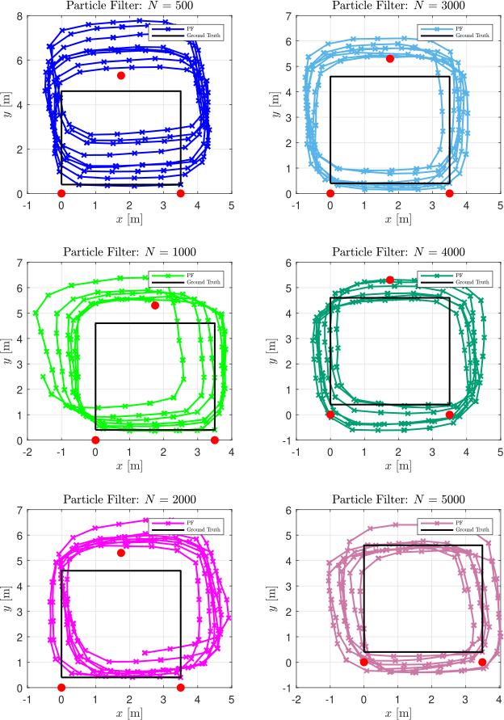

# ELEC0036 Sensor Fusion
ELEC0036: Sensor Fusion - Indoor Localisation via Bluetooth Low Energy and Inertial Measurement Unit Sensor Fusion, implemented on an Arduino Nano ESP32. Indoor localisation is an ongoing topic of research with numerous applications such as
asset tracking for warehouses, patient tracking, autonomous mobile robotics, and smartphone indoor navigation. This project focused on implementing sensor fusion techniques on resource constrainted devices with a specific focus on smartphone navigation.

## Project Overview
This project focuses on developing an Indoor Positioning System (IPS) using Bluetooth Low Energy (BLE) and Inertial Measurement Units (IMUs) to fuse sensor data and provide accurate indoor localisation. The system leverages Received Signal Strength Indicator (RSSI) trilateration from fixed Raspberry Pico transmitters and the mobile Arduino Nano ESP32 receiver. This is then combined with accelerometer and gyroscope data from the BNO085 for step detection and heading determination. The BLE and IMU technologies were combined through a Kalman Filter and a Particle Filter. The proposed solution achieves positional inference by using a Particle Filter with an average error of 0.9952 m and a standard deviation of 0.5575 m.

## Project Goals
- Accuracy: To achieve an IPS that has greater accuracy when employing sensor
fusion as compared to individual sensor measurements.
- Robustness: To ensure reliable performance when faced with issues like multipathing and signal attenuation.
- Latency: To provide real-time positioning information with reduced delay.
- Scalability: To have a system that can be easily deployed whilst remaining economically viable during large-scale deployment.
- Power Consumption: To ensure solution can be deployed in battery-powered
applications for long durations.

## Theory

### 1. **State-Space Model**
The state-space model includes step

#### **State Equation**:
The position update for $ \hat{x}_k $ and $ \hat{y}_k $ is defined as:

$$
\hat{x}_k = \hat{x}_{k-1} + \lambda_k \cos(\psi_k) + Q_x
$$

$$
\hat{y}_k = \hat{y}_{k-1} + \lambda_k \sin(\psi_k) + Q_y
$$

Where:
- $ \hat{x}_k $, $ \hat{y}_k $ are the estimated positions at time step $ k $,
- $ \lambda_k $ is the step length,
- $ \psi_k $ is the heading (orientation) at time step $ k $,
- $ Q_x $, $ Q_y $ are the process noise terms for the position.

#### **Matrix Form**:
The above equations can be expressed in matrix form as:

$$
\begin{bmatrix}
\hat{x}_k \\
\hat{y}_k
\end{bmatrix}
=
\begin{bmatrix}
1 & 0 \\
0 & 1
\end{bmatrix}
\begin{bmatrix}
\hat{x}_{k-1} \\
\hat{y}_{k-1}
\end{bmatrix}
+
\begin{bmatrix}
\lambda_k \cos(\psi_k) \\
\lambda_k \sin(\psi_k)
\end{bmatrix}
+
\begin{bmatrix}
Q_x \\
Q_y
\end{bmatrix}
$$

This simplifies to:

$$
\hat{x}_k = F_k \hat{x}_{k-1} + B_k u_k + Q_k
$$

#### **Observation Model**:
The observation model, obtained from BLE trilateration, can be expressed as:

$$
\begin{bmatrix}
\hat{x}_k \\
\hat{y}_k
\end{bmatrix}
=
\begin{bmatrix}
1 & 0 \\
0 & 1
\end{bmatrix}
\begin{bmatrix}
\hat{x}_{k-1} \\
\hat{y}_{k-1}
\end{bmatrix}
+
\begin{bmatrix}
R_x \\
R_y
\end{bmatrix}
$$

This simplifies to:

$$
z_k = H_k \hat{x}_k + R_k
$$

### 2. **Kalman Filter Equations**
The Kalman Filter equations predict and update the system state based on linear dynamics and Gaussian noise assumptions.

#### **Prediction Step:**

$$
\hat{x}_{k|k-1} = F_k \hat{x}_{k-1|k-1} + B_k u_k
$$

$$
P_{k|k-1} = F_k P_{k-1|k-1} F_k^T + Q_k
$$

Where:
- $ \hat{x}_{k|k-1} $ is the predicted state estimate,
- $ F_k $ is the state transition matrix,
- $ u_k $ is the control input vector,
- $ B_k $ is the control input matrix,
- $ P_{k|k-1} $ is the predicted error covariance,
- $ Q_k $ is the process noise covariance matrix.

#### **Update Step:**

$$
K_k = P_{k|k-1} H_k^T \left( H_k P_{k|k-1} H_k^T + R_k \right)^{-1}
$$

$$
\hat{x}_{k|k} = \hat{x}_{k|k-1} + K_k \left( z_k - H_k \hat{x}_{k|k-1} \right)
$$

$$
P_{k|k} = (I - K_k H_k) P_{k|k-1}
$$

Where:
- $ K_k $ is the Kalman gain,
- $ z_k $ is the measurement vector,
- $ H_k $ is the observation matrix,
- $ R_k $ is the measurement noise covariance matrix,
- $ P_{k|k} $ is the updated error covariance.

#### **Initialisation:**

$$
\hat{x}_0 = x_0
$$

$$
P_0 = \nu_0 \cdot I
$$

Where $ \nu_0 $ is the initial noise level, and $ I $ is the identity matrix.

---

### 3. **Particle Filter Equations**
The Particle Filter is a Monte Carlo method used for non-linear and non-Gaussian systems. It works by generating a set of particles to approximate the posterior distribution.

#### **Particle Filter Procedure**:

1. **Initialisation**: 
   $$ X_0^{(i)} \sim p(x_0), \, i = 1, 2, \dots, N $$

2. **Prediction**:
   $$ X_k^{(i)} \sim p(x_k | X_{k-1}^{(i)}), \, i = 1, 2, \dots, N $$

3. **Update Weights**:
   $$ w_k^{(i)} = p(z_k | X_k^{(i)}), \, i = 1, 2, \dots, N $$

4. **Normalise Weights**:
   $$ \tilde{w}_k^{(i)} = \frac{w_k^{(i)}}{\sum_{j=1}^{N} w_k^{(j)}} $$

5. **Resampling**:
   Resample particles $ X_k^{(i)} $ according to the normalised weights $ \tilde{w}_k^{(i)} $.

6. **Estimate**:
   $$ \hat{x}_k = \sum_{i=1}^{N} \tilde{w}_k^{(i)} X_k^{(i)} $$

#### **Gaussian Likelihood Function** (used in the weight update):

$$
\Phi(x) = \frac{1}{\sqrt{2 \pi \sigma^2}} e^{-\frac{(x - \mu)^2}{2 \sigma^2}}
$$

Where:
- $ X_k^{(i)} $ is the i-th particle,
- $ w_k^{(i)} $ is the weight for the i-th particle,
- $ \hat{x}_k $ is the estimated state.

## Results
### Kalman Filter

### Particle Filter

